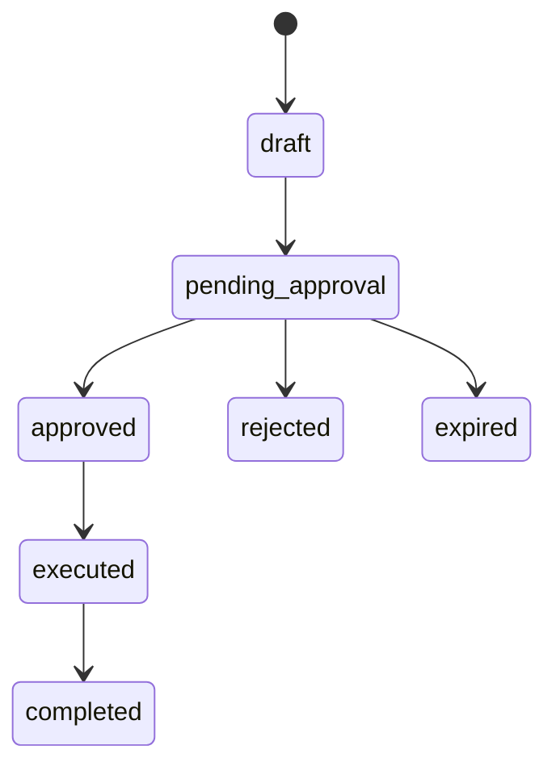
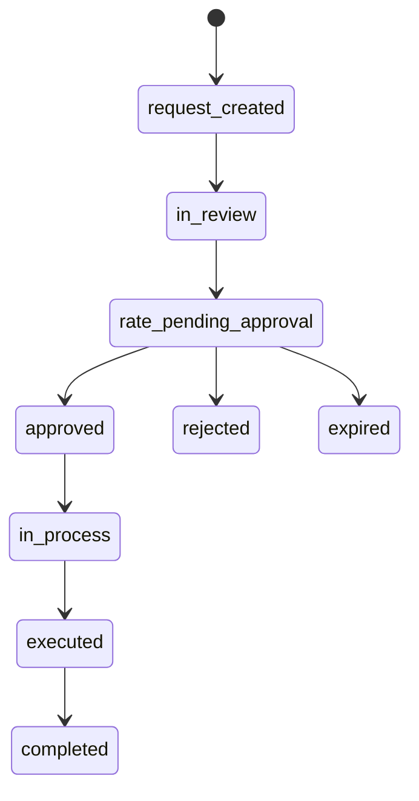
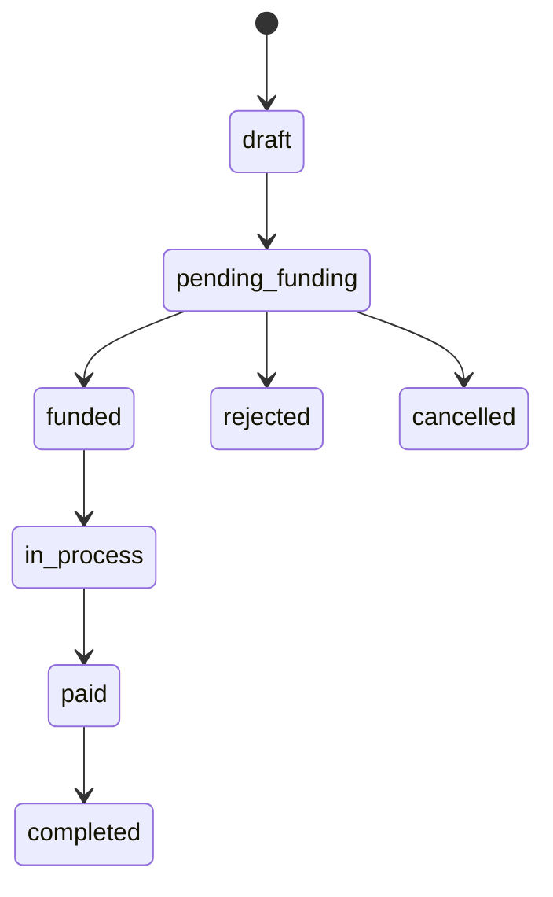

# Product Spec: Magna Equity Partner Portal

## 1. Arquitectura funcional

El portal funciona como un sistema multiempresa donde Magna Equity administra la operación y cada partner, empezando por Yango, consulta, solicita y aprueba flujos. La primera versión usa una aplicación monolítica Flask con base relacional SQLite para demo; el diseño de entidades permite migrar a PostgreSQL en Railway sin cambiar el modelo funcional.

Módulos MVP:

- Dashboard operativo con solicitudes abiertas, saldos y actividad reciente.
- Bandeja única de aprobaciones para compras y ventas.
- Libro de operaciones con detalle, adjuntos y timeline.
- Pagos a partners y proveedores.
- Cuentas bancarias y wallets operativas.
- Beneficiarios precargados por Yango.
- Saldos conciliables y links externos de consulta.
- Administración de vigencia de tasas y flujos.

## 2. Modelo de datos

Entidades principales:

- `partners`: clientes/partners creados por Magna.
- `users`: usuarios internos por partner y usuarios Magna.
- `accounts`: cuentas bancarias, wallets y custodias usadas en la operación.
- `beneficiaries`: partners/proveedores destino de pagos.
- `operations`: compras USD, ventas USD y pagos.
- `attachments`: soportes documentales por operación.
- `audit_events`: timeline auditable de cada operación.
- `settings`: parámetros editables como vigencia de tasa y listas de estados.

Relaciones clave:

- Un `partner` tiene muchos `users`, `accounts`, `beneficiaries` y `operations`.
- Una `payment` puede vincularse a una `sell_usd` mediante `linked_operation_id`.
- Una operación puede tener múltiples `attachments` y `audit_events`.
- `source_account_id` y `destination_account_id` conectan movimientos con conciliación.

## 3. Flujos de usuario

Compra USD:

1. Magna crea solicitud con bolívares, tasa, cuenta VES y cuenta USD.
2. El sistema calcula comisión bancaria, bolívares netos y USD estimados.
3. La solicitud aparece en aprobaciones del partner.
4. Yango aprueba o rechaza con comentario obligatorio.
5. Si vence la vigencia configurada, pasa a `expired`.
6. Magna ejecuta la compra, carga soportes separados y actualiza saldos.

Venta USD:

1. Yango solicita bolívares requeridos y razón de uso.
2. El sistema crea una operación `sell_usd` para Magna.
3. Magna carga tasa, cuenta salida USD y cuenta entrada VES.
4. Yango aprueba o rechaza con comentario.
5. Magna ejecuta la venta, carga soportes y actualiza saldos.

Pagos:

1. Yango crea solicitud de pago a partner o proveedor.
2. Selecciona beneficiario, monto, moneda y soporte documental.
3. El sistema autogenera venta USD vinculada para fondeo.
4. Al ejecutarse la venta, el pago queda `funded`.
5. Magna ejecuta la dispersión y descuenta saldo de la cuenta origen.

## 4. Pantallas MVP

- Dashboard
- Aprobaciones
- Operaciones
- Pagos y dispersión
- Cuentas y wallets
- Saldos y conciliación
- Administración

## 5. Permisos por rol

| Rol | Capacidades |
| --- | --- |
| Magna Admin | Crear partners, editar cuentas, crear compras USD, cargar tasas de venta, ejecutar operaciones, cargar soportes, configurar vigencias. |
| Super-approver | Ver operaciones del partner, aprobar/rechazar tasas y operaciones con comentario. |
| Tesorería | Ver operaciones del partner y aprobar/rechazar tasas. |
| Finanzas | Crear pagos, gestionar beneficiarios y aprobar pagos/dispersión. |

Regla importante: cuentas bancarias y wallets solo son editables por Magna. Yango solo las visualiza.

## 6. Diagramas de estados

Compra USD:

Venta USD:

Pagos:

## 7. Stack recomendado

MVP/demo:

- Flask
- SQLite
- HTML/CSS/JS
- Railway con Gunicorn

Producción:

- FastAPI o Django
- PostgreSQL
- Object storage para adjuntos
- Auth gestionada con SSO o Auth0/Clerk
- Background worker para expiraciones y conciliación
- Auditoría append-only

## 8. Plan por fases

Fase 1: Demo operativa

- Flujos compra/venta/pagos.
- Roles simulados.
- Saldos básicos.
- Adjuntos nominales.
- Timeline auditable.

Fase 2: Producto piloto

- Login real.
- PostgreSQL.
- Carga real de archivos.
- Permisos por partner.
- Notificaciones de aprobación.
- Exportes de conciliación.

Fase 3: Producción

- Auditoría inmutable.
- Integración con bancos/custodios cuando aplique.
- Reportes contables.
- SLA de aprobaciones.
- Controles de cumplimiento.

## 9. User stories

- Como Magna Admin, quiero crear una solicitud de compra USD para que Yango apruebe la tasa vigente.
- Como Tesorería Yango, quiero aprobar una tasa con comentario para dejar trazabilidad.
- Como Magna Admin, quiero que las tasas expiren automáticamente para evitar aprobaciones fuera de mercado.
- Como Finanzas Yango, quiero solicitar un pago reutilizando beneficiarios para evitar recaptura manual.
- Como Magna Admin, quiero cargar soportes separados de bolívares y dólares para conciliar cada tramo.
- Como Yango, quiero ver saldos y links externos disponibles para validar información operativa.
- Como auditor, quiero abrir una operación y ver eventos, adjuntos, usuarios, cuentas y relaciones end-to-end.

## 10. Criterios de aceptación

Compra USD:

- Calcula USD usando bolívares netos después de comisión bancaria.
- Muestra vencimiento de tasa.
- Requiere comentario para aprobar/rechazar.
- Al ejecutar, actualiza cuenta VES, comisión bancaria y cuenta USD.
- Guarda soportes y eventos en timeline.

Venta USD:

- Se puede iniciar desde una necesidad de bolívares.
- Magna puede cargar tasa para aprobación.
- La aprobación requiere comentario.
- Al ejecutar, descuenta USD y suma VES.
- Puede fondear pagos vinculados.

Pagos:

- Requiere beneficiario, monto, tipo y soporte documental.
- Distingue pagos a partners y proveedores.
- Autogenera venta USD de fondeo.
- Cambia a `funded` cuando la venta vinculada se ejecuta.

Cuentas/saldos:

- Magna puede crear cuentas y configurar comisión bancaria.
- Partner puede visualizar cuentas.
- Saldos reflejan compras, ventas, pagos y comisiones.
- Links externos son visibles cuando Magna los configura.

Auditoría:

- Toda operación tiene ID único.
- Todo cambio relevante crea evento con timestamp.
- Aprobaciones/rechazos guardan usuario y comentario.
- Adjuntos quedan categorizados por operación.

## Supuestos y decisiones pendientes

- La autenticación real todavía no está definida.
- Railway debe estar bajo el equipo/cuenta Magna Equity.
- La carga real de archivos está simulada por nombre en el MVP.
- La fuente oficial de tasas no está definida; Magna las carga manualmente.
- El esquema contable final de comisiones necesita validación con Magna/Yango.
- El dominio custom dependerá del DNS que controle Magna.
